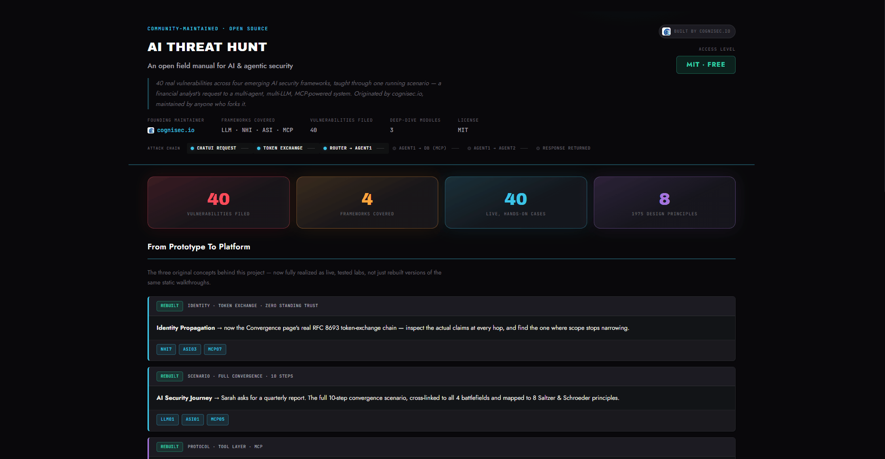

<div align="center">

# 🕵️ AI Threat Hunt

**An open field manual for AI & agentic security — learn by breaking it, then fixing it.**

40 real vulnerabilities across four frameworks. One converging attack scenario. A methodology to run it for real.
No login. No paywall. Fork the whole thing.



Founding maintainer: **[cognisec.io](https://cognisec.io)** — *Intelligence Secures Tomorrow*

</div>

---

## What this is

Most AI security education is a reading list. This isn't — every vulnerability here has a **live target you actually have to crack**: craft a real prompt injection against a simulated agent, configure permission scopes and watch a breach succeed or fail, spot a poisoned tool description among clean ones, or drain a mock API budget past a rate limiter.

Two stages, every time: break it under default (insecure) conditions, then break it *again* after the fix goes up — because a defense that only stops the exact attack you already tried isn't proof of anything.

## Live modules

| Module | What it is |
|---|---|
| 🏠 [**Hub**](./ai-threat-hunt-hub.html) | Start here — links to everything below |
| 🧩 [**LLM Security**](./llm-security-battlefield.html) | 10 cases — prompt injection, data leakage, output handling, and more |
| 🔑 [**NHI Security**](./nhi-security-battlefield.html) | 10 cases — service accounts, secrets, credential lifecycle |
| 🤖 [**Agentic Security (ASI)**](./asi-security-battlefield.html) | 10 cases — goal hijacking, tool misuse, rogue agents |
| 🔌 [**MCP Security**](./mcp-security-battlefield.html) | 10 cases — tool poisoning, scope creep, shadow servers |
| ⚡ [**AI Security: Convergence**](./ai-security-convergence.html) | The "boss battle" — one 10-step scenario where all four frameworks collide, with real RFC 8693 token-exchange claims at every hop |
| 📖 [**Field Manual**](./field-manual.html) | Not a case to crack — the actual methodology for running a red-team engagement, with working checklists |

## Running it

No build step, no server, no dependencies. Clone or download the repo, keep all files in the same folder, and open `ai-threat-hunt-hub.html` in a browser.

```bash
git clone https://github.com/cognisec-io/ai-threat-hunt.git
cd ai-threat-hunt
open ai-threat-hunt-hub.html   # or just double-click it
```

**One honest caveat:** progress tracking, hints, and checklist persistence use `window.storage`, an API provided by the Claude.ai artifact runtime. Outside that environment, every challenge, hint, and link still works identically — progress just won't survive a page reload. Swapping those calls for `localStorage` is a small, welcome contribution if you want a fully standalone build.

## Project structure

```
ai-threat-hunt/
├── ai-threat-hunt-hub.html          # entry point
├── field-manual.html                # methodology + working checklists
├── ai-security-convergence.html     # the converged 10-step scenario
├── llm-security-battlefield.html    # LLM01–LLM10
├── nhi-security-battlefield.html    # NHI01–NHI10
├── asi-security-battlefield.html    # ASI01–ASI10
├── mcp-security-battlefield.html    # MCP01–MCP10
├── images/
│   └── demo.gif                     # README demo
├── README.md
└── CONTRIBUTING.md
```

## Credits & sources

This project is a teaching layer built on top of real, ongoing community research — not a replacement for it. Every vulnerability description, mitigation, and scenario was paraphrased from the following, with full credit to the people doing the actual research:

| Framework | Source | License (per source) |
|---|---|---|
| **LLM Security** | [OWASP Top 10 for LLM Applications 2025](https://genai.owasp.org) | CC BY-SA 4.0 |
| **NHI Security** | [OWASP Non-Human Identities Top 10](https://owasp.org/www-project-non-human-identities-top-10/) | Per OWASP project terms — verify current license on source |
| **Agentic Security (ASI)** | [OWASP Top 10 for Agentic Applications, 2026](https://genai.owasp.org/resource/owasp-top-10-for-agentic-applications-for-2026/) | Per OWASP project terms — verify current license on source |
| **MCP Security** | [OWASP MCP Top 10 (beta)](https://owasp.org/www-project-mcp-top-10/) | **CC BY-NC-SA 4.0 — non-commercial** |
| **Field Manual** | [OWASP GenAI Red Teaming Guide v1.0](https://genai.owasp.org/resource/genai-red-teaming-guide/) | CC BY-SA 4.0 |

> **⚠️ License note:** the MCP Top 10 source is licensed **non-commercial** (CC BY-NC-SA 4.0), unlike the other sources here. All content in this project is paraphrased rather than reproduced, but if you're planning any commercial use of this repository, review that license directly before doing so — don't take our word for it. The NHI and Agentic Top 10 projects are newer, active, and their license terms should also be re-checked at the source before commercial reuse, since OWASP GenAI Security project terms have shifted before and may again.

Real-world breach and research references cited throughout the cases (EchoLeak, various CVEs, the OWASP GenAI Security project's incident write-ups, and others) belong to their original reporters and are cited, not reproduced.

Saltzer & Schroeder's 1975 design principles, referenced on the Convergence page, are foundational public computer science — no attribution dispute there, just respect.

## Who runs this

**[cognisec.io](https://cognisec.io)** — *Intelligence Secures Tomorrow* — started this board and keeps the lights on. But the case files don't belong to us. This is a teaching layer on top of open community research, not a product.

Found a bug in a fix? Think a case is filed wrong? Want to add a threat class we haven't covered? Fork it, file it, send a PR. No account, no gate.

## Contributing

- **Found something broken?** Open an issue.
- **Want to add a case?** Every case follows the same pattern — a Briefing (what's actually going on), an Attempt (a live target with a real two-stage win condition), and a Debrief (why the fix works). Look at any existing case in the mechanic you want to extend (`chat`, `configure`, `investigate`, `meter`, or `timelapse`) as a template.
- **Spotted a license or attribution issue?** These matter a lot here — flag it immediately, no question is a bad question.

## License

The original code, game design, mechanics, and this specific presentation are released under the **MIT License** — see [`LICENSE`](./LICENSE).

This covers *our* work. It does not relicense the underlying OWASP source material credited above, which carries its own license terms (including one non-commercial source — see the callout above). When in doubt about what you can do with a specific piece of content, trace it back to its cited source rather than assuming MIT covers everything in the repository.

---

<div align="center">

*Intelligence secures tomorrow.*

</div>